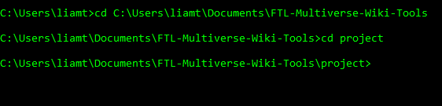

# FTL: Multiverse Wiki Tools

This project contains scripts and mods for [*FTL: Multiverse*](https://subsetgames.com/forum/viewtopic.php?f=11&t=35332) used to make editing the [*FTL: Multiverse* Wiki](https://ftlmultiverse.fandom.com/wiki) easier. It is written with [Python](https://www.python.org/downloads).

# Features

- *FTL: Multiverse* scripts and mods adding Wiki information to the blueprints of most objects found on [Player ships](https://ftlmultiverse.fandom.com/wiki/Player_ships).
- A script [exporting ship information](./project/wikiShipExport.py) so it can be easily copy-pasted to the Wiki.
- A script [comparing old/new versions of *FTL: Multiverse*](./project/compareVersions.py) to determine which object blueprints were added, removed, or changed.

# Requirements:

- The game [*FTL: Faster Than Light*](https://en.wikipedia.org/wiki/FTL:_Faster_Than_Light)
- The mod [*FTL: Multiverse*](https://subsetgames.com/forum/viewtopic.php?f=11&t=35332) 5.0+ and everything it requires.
- [SlipstreamModManager](https://subsetgames.com/forum/viewtopic.php?t=17102)
- [Python version 3.9.2 or later](https://www.python.org/downloads/). If Python is not installed on your system, download it.
- The [*FTL: Multiverse*](https://subsetgames.com/forum/viewtopic.php?f=11&t=35332) mod files to be in  `SlipstreamModManager`'s `/mods/` folder.
- Load order: In [SlipstreamModManager](https://subsetgames.com/forum/viewtopic.php?t=17102), all the mods should be patched AFTER *FTL: Multiverse*.

# Introduction

<details>
  <summary><b>View Explanation</b></summary>
<br>

In *FTL: Faster Than Light*, game data is contained in [XML files](https://en.wikipedia.org/wiki/XML). Each in-game object has a blueprint: an XML element detailing the object and dictating its behavior. 

*FTL: Multiverse* follows the same schema. However, it introduces more than 500 objects compared to the original game. This can make updating the *FTL: Multiverse* Wiki between *FTL: Multiverse* updates time-consuming when done manually.

A script to extract game information from object blueprints could help in editing the Wiki. However, most object blueprints do not contain enough information to determine what page on the *FTL: Multiverse* Wiki they belong to. This means that extracted information for objects would not include hyperlinks to their page on the Wiki. Hyperlinks would have to be added manually. Additionally, details from an object's blueprint, like its in-game name, do not always match its heading or how it is referred to on the Wiki.

This project includes a two-step solution. The first step matches object blueprints to their Wiki page and provides additional information where necessary. The second step adds elements containing Wiki information to existing blueprints. This enables a script extracting game information to refer to objects correctly and include hyperlinks to their Wiki page.

</details>

<details>
  <summary><b>Show Two-Step Solution Details</b></summary>

### Step 1: Add blueprintLists to Game Files

The first step involves a `.append` file in the folder [Append Wiki blueprintsLists](/project/Append%20Wiki%20blueprintLists/data), [autoBlueprints.xml.append](./project/Append%20Wiki%20blueprintLists/data/autoBlueprints.xml.append). It is an XML file that uses blueprintLists to associate in-game objects with their corresponding Wiki page. It also contains information for objects where the blueprint information doesn't match the Wiki.

See the [autoBlueprints.xml.append file](./project/Append%20Wiki%20blueprintLists/data/autoBlueprints.xml.append) file for more information.

Before the next step, the `.append` file is added to the game's existing files using [SlipstreamModManager](https://subsetgames.com/forum/viewtopic.php?t=17102).

### Step 2: Append Information to blueprints

A script called [appendWikiElements.py](./project/appendWikiElements.py) generates `.append` files adding Wiki information to existing blueprints. It uses the added information from the last step to override blueprint information where necessary.

The generated `.append` files are added to the game files with SlipstreamModManager. With that, each blueprint referred to by Player Ships is given elements detailing their location on the Wiki.

</details>

<details>
  <summary><b>Show Details for Other Scripts</b></summary>

### Exporting Ship Data

After following the two-step solution, a script called [wikiShipExport.py](./project/wikiShipExport.py) can be used to extract information about Player Ships from the game files and format it for the Wiki. The resulting file is inserted into a file called `wikiShips.txt`.

</details>

# Instructions

Before using the mod, ensure all [Requirements](#requirements) have been met and that the [Disclaimer](#disclaimer) has been read.

There are two ways to use the script adding information to the game files. The first way is [automatically](#automatic-method), which is recommended. The second way is [manually](#manual-method).

## Disclaimer

The scripts use mods whose effect on game data while running *FTL: Multiverse* is untested. Your game data could become corrupted and unusable. It is recommended to backup game data before using the mods and scripts. Game data is commonly found in the folder `Documents/My Games/FasterThanLight`. Copy all files in that folder to another folder to backup the game data.

## Automatic Method

<details>
  <summary><b>Show Automatic Method</b></summary>

### Windows:

- The name of the *FTL: Multiverse* files to be patched should be specified in [wikiToolsInit.py](./wikiToolsInit.py) by editing the field `multiverseFiles`. They are included by default, but editing this field may be required between updates.
- Double-click [wikiTools.bat](./wikiTools.bat) in File Explorer to run the script. By default, it includes a command to extract ship information. To disable that, delete the line `python wikiToolsCLI.py --wikiShipExport`.
- Note that the batch file [may stall if you click and drag the terminal window while it is executing](https://superuser.com/questions/1676378). Pressing the `ENTER` key with the window selected fixes this.

### Mac/Linux

- Follow the instruction from [Running in terminal](#running-from-terminal), deviating from Windows-specific instructions where necessary.
- Enter the following into terminal, one after the other: 
  ```
  python wikiToolsCLI.py --init
  ```
  ```
  python wikiToolsCLI.py --wikiInfo
  ```
  ```
  python wikiToolsCLI.py --wikiShips
  ```

<details>
  <summary><b>Script Details</b></summary>

- [wikiToolsCLI.py](./wikiToolsCLI.py) accepts command-line arguments to executes files based on user input.

- [wikiToolsInit.py](./wikiToolsInit.py) finds the location of SlipstreamModManager's `modman.jar` on your system. It requires  `modman.jar` and the project to be on the same hard drive. Additionally, there must be only one copy of `modman.jar` on the current drive.

</details>
<br>

</details>

## Manual Method

<details>
  <summary><b>Show Manual Method</b></summary>

### Step 1: Add blueprintLists

1. Go to [SlipstreamModManager Process](#slipstreammodmanager-process), with {modName} as `Append Wiki blueprintLists`.

### Step 2: Add Information

After following Step 1. There are multiple options:
  - [Run from Terminal](#running-from-terminal-step-2) (easier for beginners)
  - Run from IDE (better option for editing and development)

### Running from Terminal Step 2

1. Complete the [Running from Terminal](#running-from-terminal) instructions to open the terminal and navigate to the correct directory.
2. Enter in terminal `python ./appendWikiElements.py`. This activates the script [appendWikiElements.py](./project/appendWikiElements.py) to create the `.append` files in the `Append wikiElements` folder.
3. Go to [SlipstreamModManager Process](#slipstreammodmanager-process), with {modName} being `Append wikiElements`.

### Step 3: Export Ships

1. If the terminal was closed, or the directory changed, repeat the [Running from Terminal](#running-from-terminal) instructions.
2. Enter in terminal `python ./wikiShipExport.py`. This activates the script [wikiShipExport.py](./project/wikiShipExport.py), which outputs text to a file called `wikiShips.txt`.

### SlipstreamModManager Process:

Make sure that ZIP files are recognized by SlipstreamModManager. To enable this, in SlipstreamModManager, click in this sequence: `File -> Preferences`. In the popup, ensure the `allow_zip` option is checked.

- `{modName}` is a generic name used for the name of the mod's ZIP file.

1. ZIP the 'data' folder in the `{modName}` folder.
2. Move the ZIP file to `SlipstreamModManager/mods/`. After you've done this once for a specific ZIP file, in the future, you can change the ZIP target path to `SlipstreamModManager/mods/` and overwrite the existing ZIP file instead of moving it from the local directory.
3. In SlipstreamModManager folder, double-click `modman.jar` to start SlipstreamModManager.
4. In the list of mods, check the `{modName}` file.
5. Click 'Validate' to ensure the `{modName}` file contains valid XML. Ignore warnings about the invalid character '🗲'. For other warning messages, fix it using the information provided by SlipstreamModManager.
5. 'Patch' FTL with the relevant *`FTL: Multiverse`* mod files and the ZIP file checked. Ensure the ZIP file is listed AFTER *FTL: Multiverse*. Otherwise, the patch will not work.
6. If you receive a popup asking to start FTL, DO NOT do it. See [Disclaimer](#disclaimer) for details. The popup after patching can be disabled by following the sequence in SlipstreamModManager: `File -> Preferences` and ensuring that 'never_run_ftl' is checked.
7. Do `File-> Extract Dats...` and select the [FTL DAT](./project/FTL%20DAT/) folder. It is important that the FTL DAT folder is selected because the scripts rely on the game data being in the same directory.
8. Click `Save` in the `Extract Dats...` popup. Wait for the files to be extracted.

If coming from [Step 1](#step-1-add-blueprintlists), go to [Step 2](#step-2-add-information).

If coming from [Step 2](#step-2-add-information), go to [Step 3](#step-3-export-ships).

</details>

## Running from Terminal

(Guide for Windows)

1. In the Windows search bar, type "terminal". The app "Command Prompt" should appear. Click it to open the Command Prompt.
2. In File Explorer, locate and copy the file path of the project folder, referred to as `projectFilePath`.
3. In the terminal, enter `cd {projectFilePath}`. This changes the working directory of the terminal to where the scripts are.
4. If coming from the [Manual Method](#manual-method), also enter `cd project`.

#### Terminal Input Example



# Development Tools
- Windows 10
- [SlipstreamModManager](https://subsetgames.com/forum/viewtopic.php?t=17102)
- [Python 3.9.2](https://www.python.org/downloads)
- [Batch](https://en.wikipedia.org/wiki/Batch_file)
- [Visual Studio Code](https://code.visualstudio.com/)
